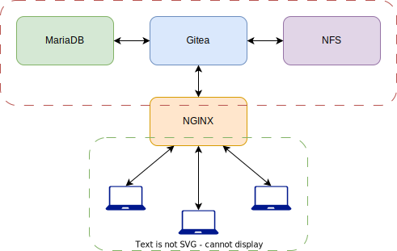

# Gitea
To not being dependent on Github for all my version control I decided to try out some self-hosted Git solutions.
I chose [Gitea](https://about.gitea.com/) after figuring out that Gitlab is just too overkill for my use case - the base installation of Gitlab installs countless
applications and requires at least 6GB of memory to work properly. Gitea is very lightweight, easy to configure and runs as a single compiled go binary.

## Environment
Below is a brief overview on how the environment should look like in the end;

* The Gitea server is a lightweight Debian instance running Gitea as a systemd service and sending logs and metrics to the monitoring server (not in the schema)
* The Gitea server connects to an NFS share on the NAS to store repository data.
* An external MariaDB instance serves as the database provider
* An nginx reverse-proxy acts as a gateway for clients to access the Gitea instance.

The internal traffic (circled red) is not encrypted. Traffic between clients and the reverse proxy is encrypted via HTTPS2.

{ align=middle }

## Installation
### MariaDB
1. Create a database utilized by Gitea
```sql
CREATE DATABASE giteadb CHARACTER SET 'utf8mb4' COLLATE 'utf8mb4_unicode_ci';
```
2. Create a database user that will be used by Gitea to read/modify the database
```sql
CREATE USER 'gitea' IDENTIFIED BY 'supersecretpassword';
```
3. Grant privileges to the database user
```sql
GRANT ALL PRIVILEGES ON gitea.* TO 'gitea';
FLUSH PRIVILEGES;
```

That's it for database creation. Of course, if the MariaDB instance is running on another machine than your Gitea server, you need to make sure that the database is listening on the proper interfaces and allows remote connections.

!!! warning
    This guide assumes that the network in which Gitea, MariaDB and any network shares reside is secured properly.
    Traffic between those parties is not encrypted!

### Gitea
First we need to prepare the operating system.
#### 1. Make sure Git is installed and at least version 2.0!
```console
git --version
```

#### 2. Create a group and user under which Gitea will run
```console
sudo groupadd --gid 1234 gitea
sudo useradd --system --uid 1234 --gid 1234 gitea
```

#### 3. Create necessary directories
```console
sudo mkdir /var/log/gitea
sudo chown -R root:gitea /var/log/gitea
sudo chmod 774 /var/log/gitea
sudo mkdir -p /var/lib/gitea/{custom,data}
sudo chown -R gitea:gitea /var/lib/gitea
sudo chmod -R 750 /var/lib/gitea
sudo mkdir /etc/gitea
sudo chown root:gitea /etc/gitea
sudo chmod 770 /etc/gitea
```

The above created directory under `/var/gitea` will be used to store general application data and custom files such as themes. Logs will be written to `/var/log/gitea` as our default Promtail service already collects all logs from this directory (**make sure promtail is allowed to read those logs**).
Also, Gitea suggests to make the configuration directory `/etc/gitea` read-only to all except root after the initiall setup via the web installer, so not even the gitea application can modify it later.
```console
chmod 750 /etc/gitea
chmod 640 /etc/gitea/app.ini
```

#### 4. Installing the binary
I usually install compiled binaries to `/opt/` and then symlink them to `/usr/local/bin`.
```console
wget https://github.com/go-gitea/gitea/releases/download/v1.20.5/gitea-1.20.5-linux-amd64
wget https://github.com/go-gitea/gitea/releases/download/v1.20.5/gitea-1.20.5-linux-amd64.sha256

sha256sum -c gitea-1.20.5-linux-amd64 gitea-1.20.5-linux-amd64.sha256

sudo mkdir /opt/gitea
sudo mv gitea-1.20.5-linux-amd64 /opt/gitea/gitea
sudo chmod +x /opt/gitea/gitea
sudo ln -s /opt/gitea/gitea /usr/local/bin/gitea
```

You should now be able to run Gitea from the path;
```console
gitea --version
Gitea version 1.20.5 built with GNU Make 4.2.1, go1.20.8 : bindata, sqlite, sqlite_unlock_notify
```

#### 5. Creating a systemd-service unit
To let gitea run as a service we need to create a new service unit configuration
```systemd
[Unit]
Description=Gitea (Git with a cup of tea)
After=syslog.target
After=network.target

[Service]
RestartSec=2s
Type=notify
User=gitea
Group=gitea
WorkingDirectory=/var/lib/gitea/
ExecStart=/usr/local/bin/gitea web --config /etc/gitea/app.ini
Restart=always
Environment=USER=gitea HOME=/home/gitea GITEA_WORK_DIR=/var/lib/gitea
WatchdogSec=30s

[Install]
WantedBy=multi-user.target
```

#### 6. Starting the web installer
At this point Gitea should be able to start the systemd service, spin up a browser and finish the installation using the web-based installer.

The steps here are pretty much self-explanatory and you should be able to fill out all the options using the information from above steps.


## Configuration
....

## Miscellaneous
### NGINX Reverse Proxy
This is a basic reverse proxy setup as taken from the [Gitea docs](https://docs.gitea.com/administration/reverse-proxies). You can further tune this by serving static assets directly from the reverse proxy. Please refer to the official docs for this.
```nginx
server {
    listen 80;
    server_name git.yourdomain.com;

    # Prevent nginx HTTP Server Detection
    server_tokens off;

    # Enforce HTTPS
    return 301 https://$server_name$request_uri;
}

server {        
    listen 443 ssl http2;
    server_name git.yourdomain.com;

    ssl_certificate /etc/ssl/certs/git.yourdomain.com.crt;
    ssl_certificate_key /etc/ssl/private/git.yourdomain.com.key;

    location / {
        client_max_body_size 512M;
        proxy_pass http://git01-atvie.home.zudrell.eu:3000;
        proxy_set_header Host $host;
        proxy_set_header X-Real-IP $remote_addr;
        proxy_set_header X-Forwarded-For $proxy_add_x_forwarded_for;
        proxy_set_header X-Forwarded-Proto $scheme;
    }
}
```

Gitea features a lot more small hacks such as fail2ban, etc. You can all find guides for those in the official docs. As I start working more with Gitea I will add such stuff here as well of course.