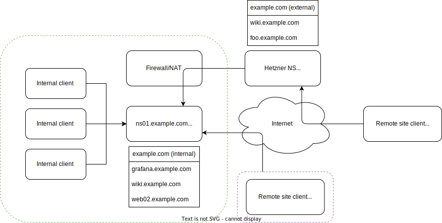

# BIND9 Stealth DNS
In this setup we are hosting an internal primary DNS that is authoritative for the `example.com` zone.
This server is **not** publicly accessible, it is strictly for internal use. Only a few Nameservers hosted at (in my case) Hetzner
are allowed to request a zone transfer from the internal DNS.

These Nameservers are publicly accessible in the internet and server the zone information on behalf of the hidden primary.

Internal clients (also those from other "branch" sites connected via Site-to-Site VPN) will only access the internal nameservers for
authoritative and recursive queries.

The zones that are transferred to the external Nameservers of course differ from the ones internally hosted, that is because the internal
zone has a lot more records for services that are not publicly accessible and also records configured via DDNS.

Below you see a schematic of how this setup looks like. Example configurations will follow.

